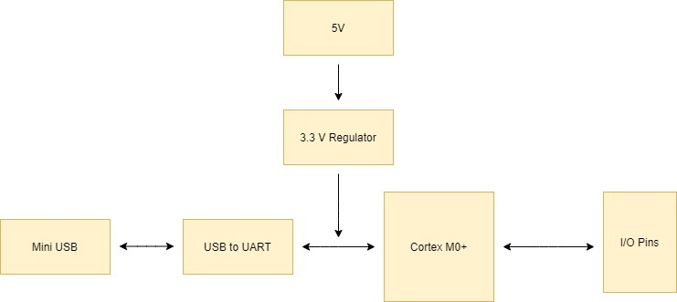
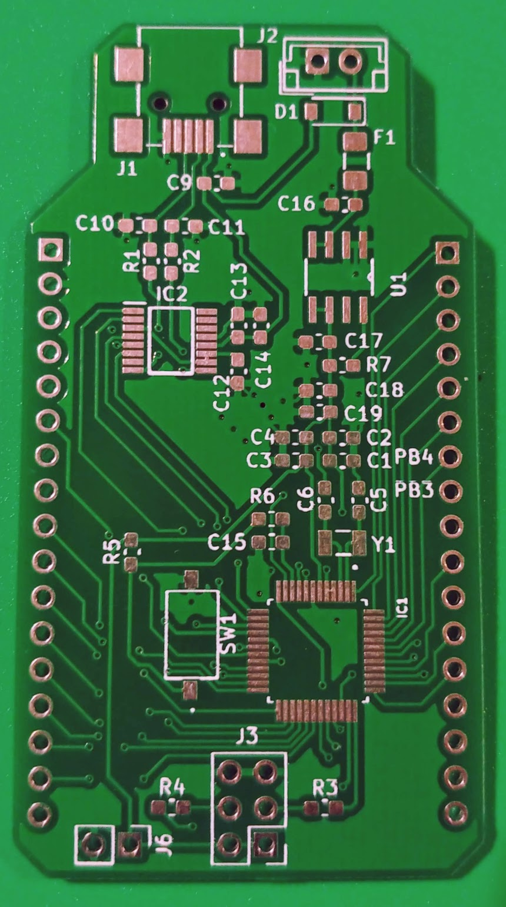
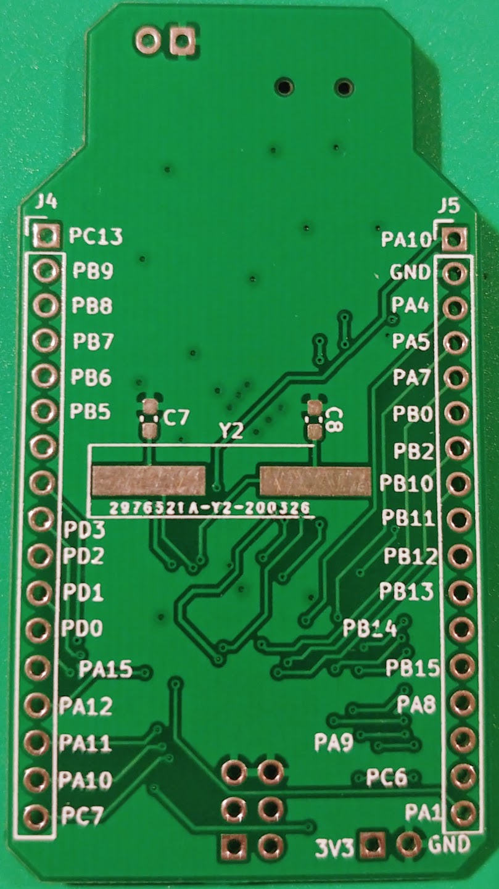

# Microcontroller Breakout Board

## Block Diagram

## Peripherals 

### Microprocessor 

* [ARM Cortex M0+](https://www.mouser.com/datasheet/2/389/dm00613881-1799439.pdf)

### USB Mini Port

* [UJ2-MBH](https://www.mouser.com/datasheet/2/670/uj2-mbh-smt-1313286.pdf)

### USB to UART

* [FT230XS-R](https://www.mouser.com/datasheet/2/163/DS_FT230X-5395.pdf)

### Voltage Regulator

* [TPS77733DR](http://www.ti.com/lit/ds/symlink/tps777.pdf)

## Images
, 

## Designers

* **Jorge Exinia** - *PCB design* - [j-exinia](https://github.com/j-exinia)

### Built With

* [KiCad](https://kicad-pcb.org/) - The PCB design software used

### Errata

